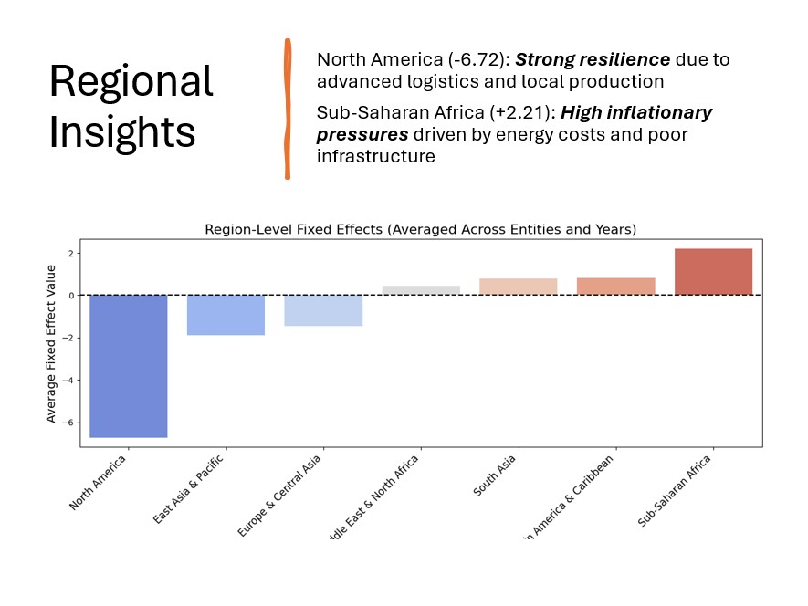
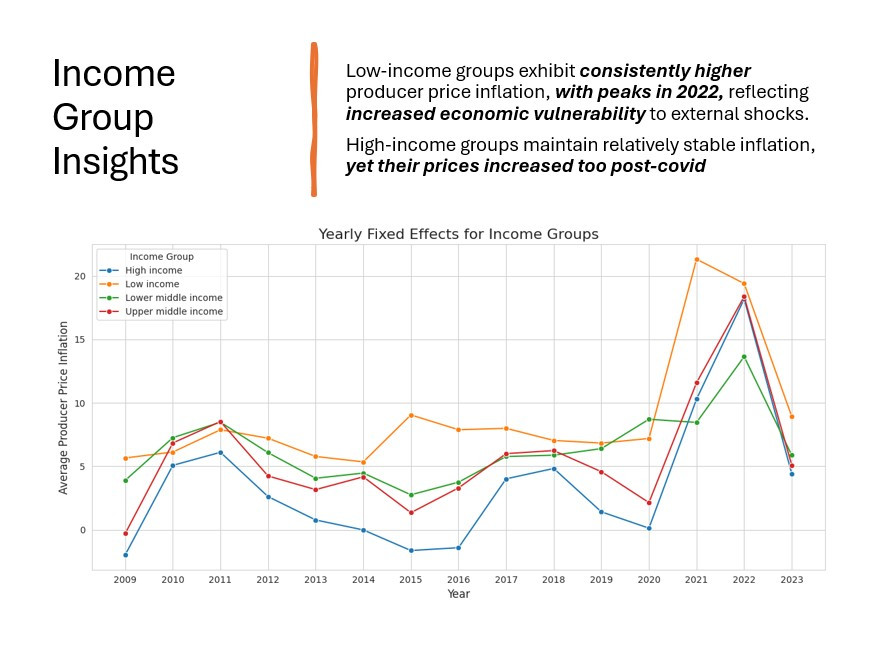
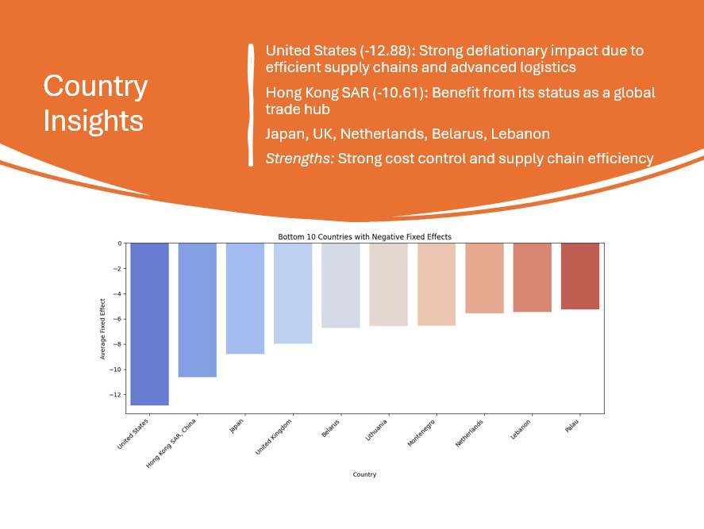
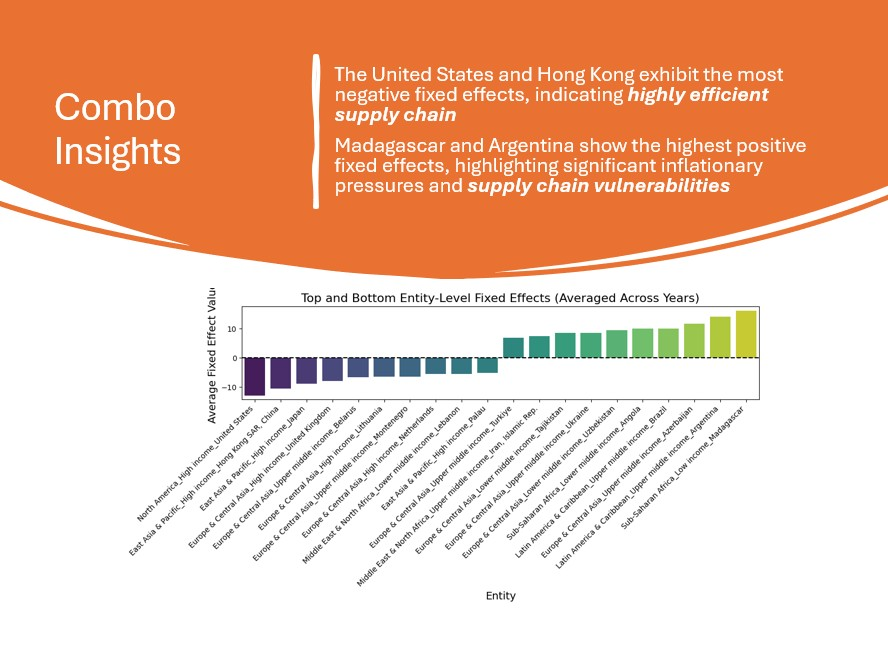
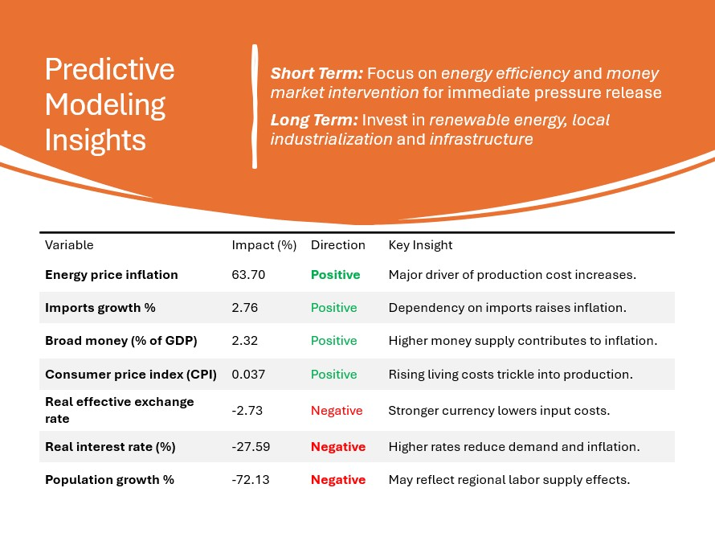
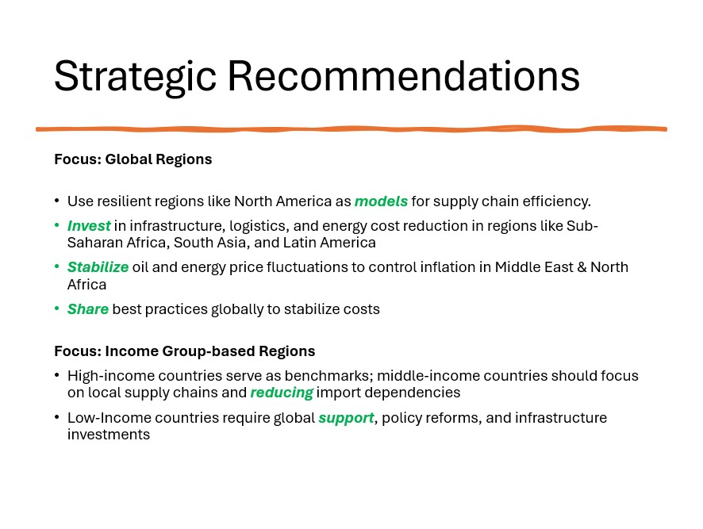
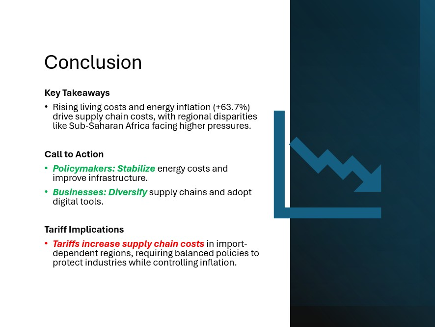

<p align="center">
  
</p>

# 📦 Supply Chain and Consumer Inflation Analysis of the World

*A global analysis of PPI (Producer Price Inflation) using World Bank panel data, with variable optimization via VIF and correlation filtering, and model selection via Fixed and Random Effects modeling.*

- Topics covered: **Macroeconomic Data Analysis**
- Models used: **Linear Regression Panel Data**
- Expected outcome:
-   **Find out inflation influencers** 
-   **Recommend ways to minimize them**

---

## 🏆 Recognition

**UofT Rotman Datathon 2025 Champion Project**

<p align="center">
  
</p>

---

## 👥 Authors

**Sam Hossain, Zaheen Mahaey**

---

## 🎯 Overview

This project investigates the key drivers of **Producer Price Inflation** across countries using a structured panel dataset sourced from the **World Bank**, **UNDP**, and other development indicators. We applied panel data regression techniques (FE/RE) and selected variables using statistical filters like VIF and correlation thresholds.

---

## 🧠 Key Features

- ✅ **Panel data regression** with country-year granularity
- ✅ **Multicollinearity reduction** using VIF & correlation matrix
- ✅ **Modeling with Fixed Effects and Random Effects**
- ✅ **Hausman Test** to determine the preferred model
- ✅ **Interactive visualizations** for data insight
- ✅ 📊 Final deliverables: PowerPoint presentation & written report

---
## 🧪 Model Insights

* Multicollinearity handled via VIF (threshold = 10) and correlation > 0.9
* Fixed and Random Effects models built on cleaned features
* Hausman Test used to choose FE vs RE
* Model 3 demonstrated the most **robust results** and interpretability

---

## 📁 Project Structure

```

Supply-Chain-Inflation-World-Bank-Data-Analysis/
│
├── notebooks/
│   ├── Datathon\_Model\_3\_Final.ipynb
│   └── Datathon\_Model\_3\_Visualization.ipynb
│
├── data/
│   ├── raw/
│   │   └── Datathon\_data-2025-Raw\.xlsx
│   └── processed/
│       └── Model 3\_Region\_Income Group.xlsx
│
├── presentation/
│   ├── Datathon-2025-Sam\_Zaheen\_PPT.pptx
│   └── Datathon-2025-Sam\_Zaheen\_Report.pdf
│
├── requirements.txt
└── README.md

````
---

## 🧾 Dashboard

* 🎯 **Presentation:** `presentation/Datathon-2025-Sam_Zaheen_PPT.pptx`
* 📄 **Report:** `presentation/Datathon-2025-Sam_Zaheen_Report.pdf`

Glimpse of our extensive research and findings dashboards:

<p align="center">
  
  
  
  
  
  
  
  
</p>

---

## 🚀 How to Run This Project

1. **Clone the repository**

   ```bash
   git clone https://github.com/YOUR_USERNAME/Supply-Chain-Inflation-World-Bank-Data-Analysis.git
   cd Supply-Chain-Inflation-World-Bank-Data-Analysis
   ```

2. **Install dependencies**

   ```bash
   pip install -r requirements.txt
   ```

3. **Launch Jupyter Notebook**

   ```bash
   jupyter notebook
   ```

4. **Open and execute notebooks**

   * `Datathon_Model_3_Final.ipynb` → Modeling
   * `Datathon_Model_3_Visualization.ipynb` → Exploratory visuals

---

## 📊 Data Sources

* 📌 [World Bank Open Data](https://data.worldbank.org/)
* 📌 UNDP Human Development Reports
* 📌 LPI, IEDE Indexes

---

## 🔓 License

This project is licensed under the [MIT License](LICENSE)

---
